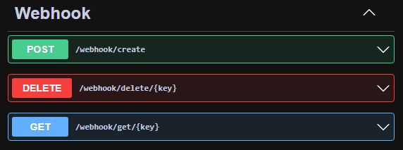

# Pix Viewer

O Pix Viewer é uma API que pode fazer intermédio de transações bancárias via PIX. O banco fornecedor das chaves de acesso precisar estar seguindo os padrões estabelecidos pelo banco central. É possível fazer a integração com qualquer dashboard frontend.

## Installation
Para instalar, use o "source code" disponível para download no repositório.

## Configuração
Toda a aplicação depende de algumas configurações que podem ser ajustadas no arquivo "App.config". O primeiro item a ser alterado é o "client_secret" e o "client_id" que é fornecido pelo banco ou instituição de pagamentos que fará as transações bancarias, neste caso, a instituição utilizada foi o [pagseguro](https://app.pipefy.com/public/form/2e56YZLK).
```xml
<?xml version="1.0" encoding="utf-8" ?>
<configuration>
	<appSettings>
		<!-- CLIENT CREDENTIALS -->
		<add key="client_id" value="seu client id aqui"/>
		<add key="client_secret" value="seu secret aqui"/>
	</appSettings>
</configuration>
```
A instituição financeira também fornecerá um certificado de segurança que será em formato PEM juntamente com a chave privada. O caminho dos arquivos devem ser fornecidos para "certificate_pem_filePath" e "certificate_key_filePath" respectivamente. No caso dos testes, foi utilizado o path "wwwroot/Certificates/PIXVIEWERAPI_SB.pem" e "wwwroot/Certificates/PIXVIEWERAPI_SB.key", porém fica a critério do desenvolvedor o caminho que será utilizado.
```xml
<?xml version="1.0" encoding="utf-8" ?>
<configuration>
	<appSettings>
		<!-- CLIENT CREDENTIALS -->
		<add key="certificate_pem_filePath" value="caminho do arquivo .pem aqui"/>
		<add key="certificate_key_filePath" value="caminho da chave privada aqui"/>
	</appSettings>
</configuration>

```
Outro item que precisa de atenção são os endpoints da fornecedora bancária. A aplicação sempre irá procurar pela URL base olhando para a chave "base_url",  tanto para produção quanto para desenvolvimento. Mantenha a key de prod comentada caso esteja em desenvolvimento e mantenha a key de desenvolvimento comentado caso esteja em produção. Exemplo: 
```xml
<?xml version="1.0" encoding="utf-8" ?>
<configuration>
	<appSettings>
		<!--API DEVELOPMENT-->
		<add key="base_url" value="https://secure.sandbox.api.pagseguro.com"/>
		
		<!--API PRODUCTION-->
		<!--<add key="base_url" value="https://api.pagseguro.com"/>-->
	</appSettings>
</configuration>
```
Os endpoints não mudam, serão sempre os mesmos tanto em prod como em desenvolimento.

```xml
<?xml version="1.0" encoding="utf-8" ?>
<configuration>
	<appSettings>
		<!--ENDPOINTS-->
		<add key="endpoint_webhook" value="/instant-payments/webhook/"/>
		<add key="endpoint_oauth2" value="/pix/oauth2"/>
		<add key="endpoint_pix" value="/instant-payments/pix"/>
		<add key="endpoint_cob" value="/instant-payments/cob/"/>
	</appSettings>
</configuration>
```
Por fim, temos as cadeias de conexão com banco de dados sqlserver, o servidor irá procurar pelo usuário "lucas", caso este seja o usuário atual da maquina, o servidor usará a conexão "pwrdtb_des",  se o usuário for diferente de "lucas" será utilizada a conexão "pwrdtb_prod". Essa configuração está localizada em "PixViewer\PixViewer.DAL\PixCobDAL.cs" no método "CheckDev()"
```xml
<?xml version="1.0" encoding="utf-8" ?>
<configuration>
	<connectionStrings>
		<add name="pwrdtb_des" connectionString="sua conexão de desenvolvimento sqlserver aqui"/>
		<add name="pwrdtb_prod" connectionString="sua conexão de produção sqlserver aqui"/>
	</connectionStrings>
</configuration>

```

## Uso da aplicação
Na solução da aplicação, é possível fazer um gerenciamento utilizando o console de testes.
Ao mudar o valor da variável "CREATE" para "true", o item "DataDefaultValuesTestDAL.Fill()" será executado para criar uma conta administradora padrão e preencher as tabelas com os valores fixos necessários para o funcionamento da aplicação. Ao criar o administrador padrão, será possível usar o endpoint de login para acessar os registros. O dev pode alterar os registros diretamnete no banco casos veja uma necessidade.
- Usuário ADM: [Login = adm, Password = 123]
- Usuário MOD: [Login = mod, Password = 123]

### Endpoints
#### Login


#### Pix


#### Pix com cobrança


#### Usuario


#### WebHooks

## Regras
Todas as regras de usuário, solicitação de recursos, criação / alteração de webhooks estão localizadas no projeto "PixViewer.BLL"

## Contributing
Solicitações de pull são bem-vindas. Para grandes mudanças, abra um problema primeiro para discutir o que você gostaria de mudar.

Certifique-se de atualizar os testes conforme as atualizações e mudanças aplicadas.

## Licença
[MIT](https://choosealicense.com/licenses/mit/)