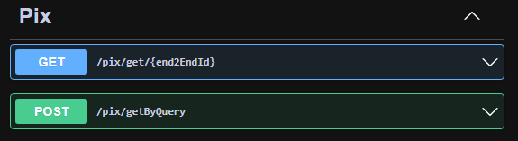
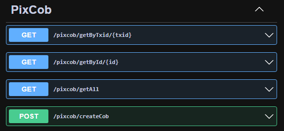
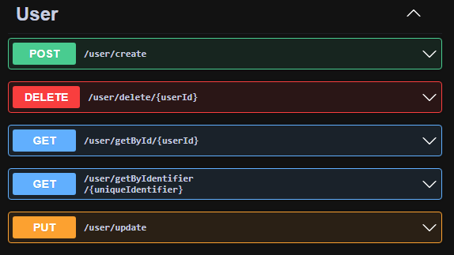

# Pix Viewer

O Pix Viewer é uma API que pode fazer intermédio de transações bancárias via PIX. O banco fornecedor das chaves de acesso precisar estar seguindo os padrões estabelecidos pelo banco central. É possível fazer a integração com qualquer dashboard frontend.

## Installation
Para instalar, use o "source code" disponível para download no repositório.

## Uso da aplicação
Na solução da aplicação, é possível fazer um gerenciamento utilizando o console de testes.
Ao mudar o valor da variável "CREATE" para "true", o item "DataDefaultValuesTestDAL.Fill()" será executado para criar uma conta administradora padrão e preencher as tabelas com os valores fixos necessários para o funcionamento da aplicação. Ao criar o administrador padrão, será possível usar o endpoint de login para acessar os registros. O dev pode alterar os registros diretamnete no banco casos veja uma necessidade.
- Usuário ADM: [Login = adm, Password = 123]
- Usuário MOD: [Login = mod, Password = 123]

### Endpoints
#### Login

#### Pix

#### Pix com cobrança

#### Usuario

#### WebHooks

## Regras
Todas as regras de usuário, solicitação de recursos, criação / alteração de webhooks estão localizadas no projeto "PixViewer.BLL"

## Contributing
Solicitações de pull são bem-vindas. Para grandes mudanças, abra um problema primeiro para discutir o que você gostaria de mudar.

Certifique-se de atualizar os testes conforme as atualizações e mudanças aplicadas.

## Licença
[MIT](https://choosealicense.com/licenses/mit/)